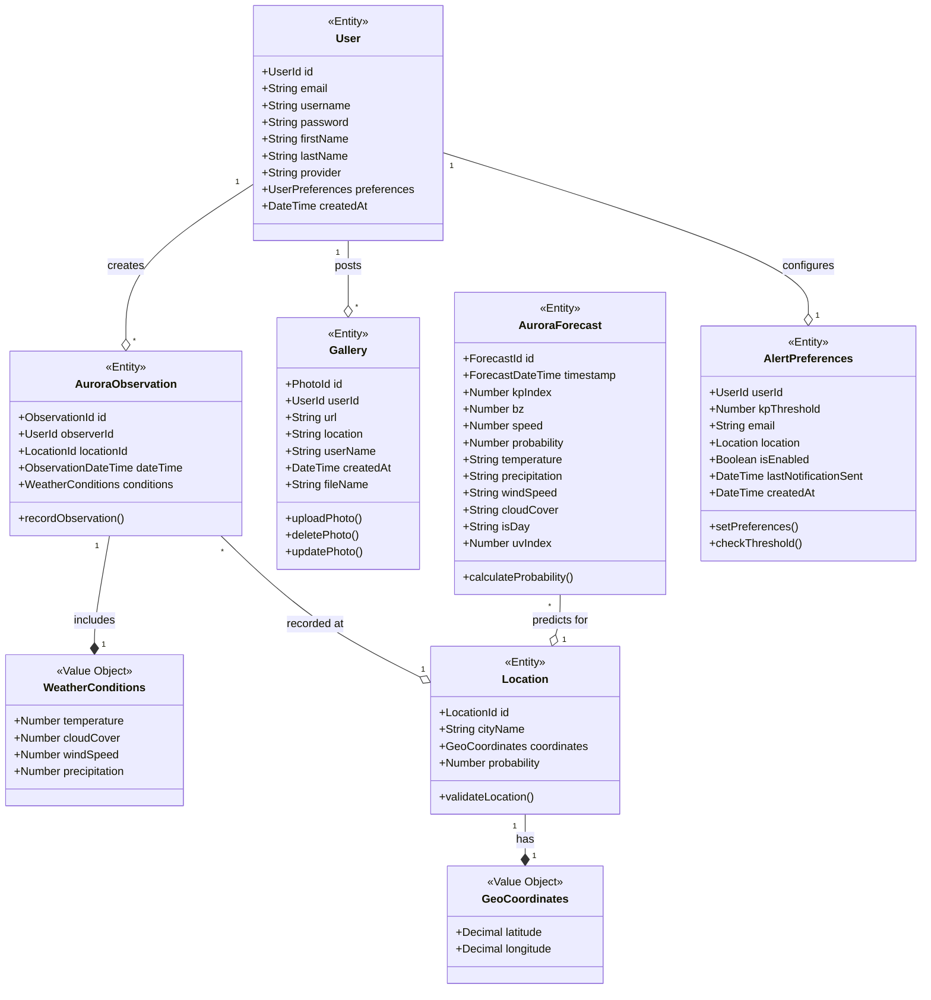

Welcome to the LightsTrail website repository.

## Project Title: LightsTrail

#### Project Description: 


LightsTrail is a web-based application designed to provide real-time aurora predictions and forecasts, enabling users to experience and track the Northern Lights at any location. Tailored for aurora enthusiasts, travelers, and photographers, the app delivers accurate aurora forecasts based on the user’s location. Users can set the preferences to alerts for receiving notifications when auroras are predicted in their location, either in real-time or triggered by specific Index thresholds. Additionally, LightsTrail fosters a community-driven platform where users can share photos, experiences, and sightings and gain insights into the best viewing spots through location-tagged posts. With a blend of observation technology and social engagement, the app offers a dynamic and engaging platform for aurora enthusiasts worldwide.


## ✨ Features

### Core Features

### Aurora Forecasting System

- Real-time KP index monitoring
- Custom probability algorithms
- Weather condition integration
- Solar wind speed tracking
- Magnetic field analysis
- Location-based predictions

### Community Gallery

- Photo sharing capabilities
- Location tagging
- Search functionality
- Photo management tools (Upload, Edit, Update, Delete)

### Alert System

- Customizable KP thresholds
- Email notifications
- Location-based alerts
- Real-time updates

### Live Best Locations

- Real-time probability calculation
- Interactive mapping
- Location suggestions
- Viewing spot details

### Information Center

- Aurora glossary
- Educational resources

## ✨ Features

### Real-time data visualization
- Real-time data visualization
- Historical data analysis
- Weather information

### WebCam Integration 

- Live aurora feeds
- Multiple viewing locations 
- Viewing guides

### Multi-language Support

- English
- Hindi
- Kannada
</details>


### Additional Features
<summary> PWA Features 📱 </summary>

- Install prompts
- Cache management
- Service worker integration

</details>


## Tech Stack

<details>
<summary>Frontend Technologies</summary>

- **Core**: React 18.3.1, TypeScript 5.7.2
- **UI Framework**: Material-UI, Tailwind CSS
- **State Management**: Redux Toolkit
- **Maps**: MapBox GL, Leaflet
- **Data Visualization**: Recharts
- **Animations**: Framer Motion
- **Internationalization**: i18next
- **HTTP Client**: Axios

</details>

<details>
<summary>Backend Technologies</summary>

- **Runtime**: Node.js
- **Framework**: Express.js
- **Database**: MongoDB
- **ODM**: Mongoose
- **Authentication**: JWT, Passport.js
- **File Handling**: Multer
- **Email Service**: Nodemailer

</details>

<details>
<summary>External APIs</summary>

- NOAA API (Aurora data)
- OpenWeather API
- Google OAuth
- Mapbox API
- Node Mailer

</details>

## Getting Started

### Prerequisites

```bash
node -v # v18.x or higher
npm -v  # 9.x or higher

### Installation

1. Clone the repository
```bash
git clone https://github.com/yourusername/lightstrail.git
```

2. Install dependencies
```bash
# Frontend
cd app
npm install

# Backend
cd service
npm install
```

3. Set up environment variables
```bash
# Frontend (.env)
VITE_API_URL=
VITE_MAPBOX_TOKEN=
VITE_GOOGLE_CLIENT_ID=

# Backend (.env)
MONGODB_URI=
JWT_SECRET=
GOOGLE_CLIENT_ID=
GOOGLE_CLIENT_SECRET=
EMAIL_USER=
EMAIL_PASSWORD=
```

4. Start development servers
```bash
# Frontend
npm run dev

# Backend
npm run dev
```


##  Architecture

### Domain Model

<details>
<summary>View Domain Model</summary>



</details>

Video Link: https://northeastern.sharepoint.com/:v:/r/sites/WEBDPROJECTTEAM/Shared%20Documents/General/Recordings/Meeting%20in%20_General_-20241207_223517-Meeting%20Recording.mp4?csf=1&web=1&nav=eyJyZWZlcnJhbEluZm8iOnsicmVmZXJyYWxBcHAiOiJTdHJlYW1XZWJBcHAiLCJyZWZlcnJhbFZpZXciOiJTaGFyZURpYWxvZy1MaW5rIiwicmVmZXJyYWxBcHBQbGF0Zm9ybSI6IldlYiIsInJlZmVycmFsTW9kZSI6InZpZXcifX0%3D&e=sooloc

## Team Memebers:
1. Pooja Doddannavar: doddannavar.p@northeastern.edu

-Pooja Doddannavar: doddannavar.p@northeastern.edu

-Aryaa Hanamar: hanamar.a@northeastern.edu

-Samarth Rayar: rayar.s@northeastern.edu

-Siddharth Nashikkar: nashikkar.s@northeastern.edu


[](https://classroom.github.com/a/DIHvCS29)


